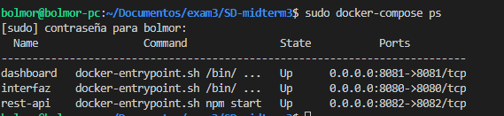

# Distributed systems third midterm #

**Universidad ICESI**  
**Course:** Distributed systems  
**Teacher:** Juan M Álvarez Q.  
**Topic:** Microservices Architecture design  
**email:** juan.alvarez8 at correo.icesi.edu.co

### Description

For this exam you should redesing the application developed in midterm 2 into a REST-based microservices arquitecture with a frontend and a health check dashboard. Your aplication must comply the following:

* Must have a github repository which is a fork of the **[sd-mdterm3](https://github.com/ICESI-Training/SD-midterm3)** repository
* It is suggested to use mlab for data storage: mlab is a database as a service provider for mongo databases.
* The system must accept HTTP requests from CURL (you can use other REST clients like postman, insomnia or postwoman).
* The application must have an endpoint to insert data in the database.
* The application must have an endpoint to retrieve all the registers from a database collection or table.
* The design must have continous integration and unit tests for all microservices.
* Microservices must be deployed on containers.
* Microservices must be orchestrated using docker-compose, docker-swarm or Kubernetes.

## Actividades (EN español para evitar ambigüedades)
1. Documento README.md en formato markdown:  
  * Formato markdown (5%).
  * Nombre y código del estudiante (5%).
  * Ortografía y redacción (5%).
2. Documentación del procedimiento para el despliegue de los contenedores. (30%)
3. Archivos fuentes en el repositorio de la aplicación implementada (15%).
4. Documentación de las tareas para desplegar la aplicación (20%).
5. El informe debe publicarse en un repositorio de github el cual debe ser un fork de https://github.com/ICESI-Training/SD-midterm3 y para la entrega deberá hacer un Pull Request (PR) al upstream (10%). Tenga en cuenta que el repositorio debe contener todos los archivos necesarios para el despliegue.
6. Documente algunos de los problemas encontrados y las acciones efectuadas para su solución (10%).

---

## Desarrollo

### Equipo de trabajo:
* Cristian Alejandro Morales López - A00328064
* Juan Esteban Quinayás Gaitán - A00027548

---

|              |   Backend     |   Frontend    |   Monitor    |
|--------------|---------------|---------------|--------------|
|  PORT        |    8082       |   8083        |   8084       |
|  LANGUAGE    |   Node.js     |   Node.js     |   Node.js    |
|  Framework   |   x           |   Vue.js      |   Vue.js     |

---

### README.md auxiliares

Tanto el *Backend* como el *Frontend* tienen su propio README.md.

---

### Métodos HTTP de la API

---

### Pruebas unitarias de la API

---

### Migración de los servicios a contenedores

**1. Contenedor con el servicio de Backend:**

Para la implementación de nuestro servicio de *Backend* en un contenedor de Docker, nos ubicamos en la carpeta *backend* y creamos el archivo *Dockerfile*. En el mismo archivo se explica lo que hace cada línea.

A continuación, se puede apreciar el Dockerfile:

 Para que no se copie la carpeta *node_modules*, se crea un archivo adicional dentro del proyecto que lleva como nombre *.dockerignore*. En este archivo se especifican todos los archivos que no se desean copiar en el contenedor. El *.dockerignore* tiene el siguiente contenido:

 

 Una vez construido el archivo *Dockerfile*, se procede a construir la imagen, para la ejecución del proyecto. Como se especificó en el *Dockerfile*, se descargará de *Dockerhub* la imagen más reciente con Node JS. Lo anterior, se lleva a cabo con el comando:

~~~
sudo docker build -t node-restapi .
~~~

***Explicación del comando:*** se ejecuta el comando con permisos de *root*. Se especifica *docker build*, para construir la imagen. La opción *-t*, es para darle un nombre a la imagen, en este caso la llamaremos node-restapi. Finalmente, se pasa como argumento un "." que significa que el *Dockerfile* se encuentra en el directorio actual. A continuación, se anexa el resultado de este comando en consola.

 

 Una vez creada la imagen y ejecutado el *Dockerfile*, podemos usar el siguiente comando para desplegar las imágenes que se han creado:

~~~
sudo docker images
~~~

Una vez creada la imagen, se ejecuta el siguiente comando para la creación del contenedor:

~~~
sudo docker run -it -p 8082:8082 node-restapi 
~~~

***Explicación del comando:*** ejecutamos el comando con permiso de administrador con *sudo*. Con *docker run* corremos el contenedor. Con la opción *-it* especificamos que la salida de la consola del contenedor se imprima en consola actual. Con la opción *-p* hacemos un mapeo de puertos entre la máquina anfitrión y el contenedor, por lo tanto, se especifica que la máquina anfitrión escucha por el puerto 8082 y el contenedor también, pero se puede realizar un mapeo de puertos diferentes (*por ejemplo:* la máquina anfitriona escuche las peticiones por el puerto 80, pero el contenedor escucha por el puerto 8082).

A continuación, se muestra el resultado del comando en consola que crea el contenedor y ejecuta el servicio.

Ahora se ejecuta una petición por medio de postman al endpoint movies, que devuelve todas las películas en la base de datos. Esto se realiza a través de una petición get al endpoint anteriormente mencionado, por medio de la url *192.168.0.201:8082/movies*.

**2. Contenedor con el servicio de Frontend:**

Para este contenedor se proceden con los mismos pasos utilizados en el *Backend*.

Se crea el *Dockerfile*.

Se ejecuta el comando:

~~~
sudo docker build -t interfaz .
~~~

Se evidencia la creación de la imagen.

Se ejecuta el comando:

~~~
sudo docker run -it -p 8080:8080 interfaz
~~~

A continuación, se evidencia el funcionamiento del *Frontend*. En el contenedor de *Docker* desplegado se especifica que la URL para ingresar al contenedor es la siguiente: *http://192.168.0.201:8080/#/methods/get*.

**3. Contenedor con el servicio de Monitor/Dashboard:**

A continuación, solo se relacionan las imágenes de los comandos ejecutados para el despliegue del Dashboard dado para el despliegue de esta herramienta utilizamos una aplicación de Vuetify para comprobar que los servicios se encuentran funcionando.

---

### Docker Compose

Para la orquestación de los contenedores del *Frontend*, del *Backend* y del *Monitor* se utiliza la herramienta docker-compose. Esta herramienta utiliza un archivo *docker-compose.yml* y a continuación explicamos su estructura.

En este primer fragmento se explica cada línea que se implementa en el archivo *docker-compose.yml* con el despliegue del contenedor con el *Backend*.

Fragmento del archivo *docker-compose.yml* con el despliegue del *Frontend*.

Fragmento del archivo *docker-compose.yml* con el despliegue del *Monitor*.

El paso para seguir es ejecutar el comando que despliega la configuración realizada en el archivo *docker-compose.yml*, que es el siguiente:

~~~
sudo docker-compose up
~~~

A continuación, se evidencia todos los servicios funcionando con el siguiente comando:

~~~
sudo docker-compose ps
~~~

---

### Frontend consumiendo Backend

---

### Monitor

---

### Problemas encontrados - Acciones efectuadas

1. Durante la realización del archivo *docker compose*, se obtuvieron algunos problemas.

Al principio de desplegaban los contenedores sin ningún problema (por línea de comando), pero al momento de realizar la orquestación de los contenedores con el comando *docker compose up*, éste imprimía en consola, que no se encontraban los archivos para copiar al contenedor.Después de volver a construir el archivo el problema se soluciona. No se descubrió cual era el problema, porque al comparar con el archivo docker-compose.yml con el archivo en el repositorio son los mismos. Cabe resaltar que este bug solo apareció algunas veces.

2. Durante el despliegue de los contenedores, se obtuvo un problema con la instalación de docker. Dado que al realizarlo en una máquina virtual, en  el momento de desplegar un contenedor, en la sala 104M este no daba permisos para realizarlo.

La solución fue realizar el despliegue de toda la infraestructura en una máquina virtual con Lubuntu 19.04, en equipo externo al laboratorio de redes, provisto con el hipervisor Proxmox.

3. Hubo problemas de CORS.

En primera instancia al querer que el Frontend consumiera el Backend. La solución fue poner 3 líneas de código (especificadas en el README.md del Backend) en el archivo *app.js* de la carpeta *backend*.

En segunda instancia al querer que el Monitor verificará si el status del Frontend. Aquí el problema es que tanto el Frontend como el Monitor son clientes (Vue), y las políticas de CORS se especifican en un servidor. Se forzaron las políticas en el Frontend para hacer que el Monitor funcionara.
